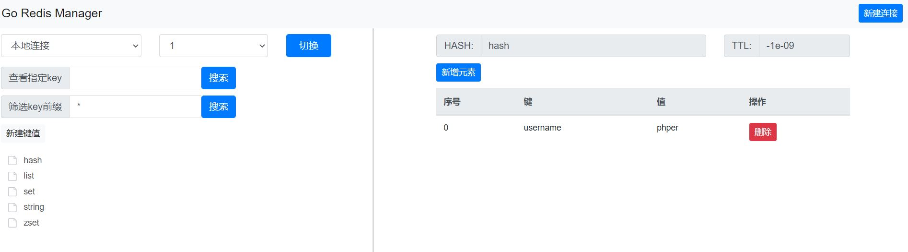

# GoRedisManager
redis web客户端管理平台。优点：跨平台、部署简单。欢迎star！！



## 功能清单

:white_check_mark:管理连接、切换DB

:white_check_mark:支持 string 类型

:white_check_mark:支持 list 类型

:white_check_mark:支持 set 类型

:white_check_mark:支持 zset 类型

:white_check_mark:支持 hash 类型

:white_check_mark:支持 stream 类型

:white_check_mark:SSH 连接 redis

:white_check_mark:用户登录验证

:white_check_mark:操作日志

## 使用文档
- [开始使用](#开始使用)
- [配置文件](#配置文件)
- [用户验证](#用户验证)

### <a name="开始使用">开始使用</a>

```shell
-c string
        配置文件路径 (default "./config.yaml")
```

```
默认访问地址：http://127.0.0.1:8088/index
```

### <a name="配置文件">配置文件</a>

```yaml
connections:
# 不启动ssh的配置方法  
- servicename: localhost
  host: 127.0.0.1
  port: "6379"
  password: ""
  usessh: 0
  sshconfig:
    sshhost: ""
    sshport: ""
    sshusername: ""
    sshpassword: ""
# 启动ssh的配置方法     
- servicename: ceshi
  host: 127.0.0.1
  port: "6379"
  password: redispass
  usessh: 1
  sshconfig:
    sshhost: 127.0.0.1
    sshport: "2203"
    sshusername: root
    sshpassword: "123456"
hostname: 127.0.0.1
port: "8088"
#启用用户登录验证 不需要此功能则将 accounts 数据块注释掉即可
accounts:
- account: "admin"
  password: "123456"
```

### <a name="用户验证">用户验证</a>

在配置文件中设置 accounts 属性即为默认开启用户验证
```yaml
#启用用户登录验证 不需要此功能则将 accounts 数据块注释掉即可
accounts:
- account: "admin"
  password: "123456"
```

