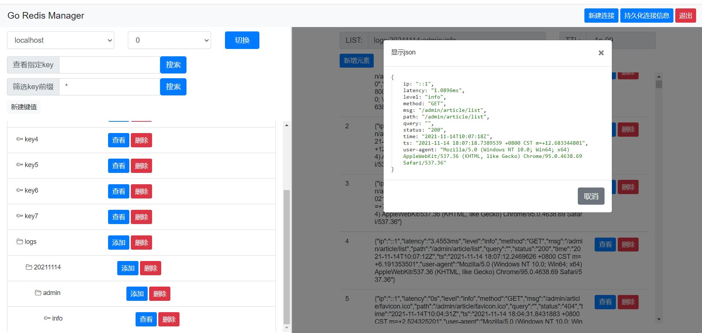

# GoRedisManager
redis web客户端管理平台。优点：跨平台、部署简单



## 功能清单

:white_check_mark:管理连接、切换DB

:white_check_mark:支持 string 类型

:white_check_mark:支持 list 类型

:white_check_mark:支持 set 类型

:white_check_mark:支持 zset 类型

:white_check_mark:支持 hash 类型

:white_check_mark:支持 stream 类型

## 使用文档
- [开始使用](#开始使用)
- [配置文件](#配置文件)

### <a name="开始使用">开始使用</a>

```shell
-c string
        配置文件路径 (default "./config.yaml")
```

```
默认访问地址：http://127.0.0.1:8088/admin/index
```

### <a name="配置文件">配置文件</a>

```yaml
connections:
- servicename: localhost
  host: 127.0.0.1
  port: "6379"
  password: ""
hostname: 127.0.0.1
port: "8088"
```


